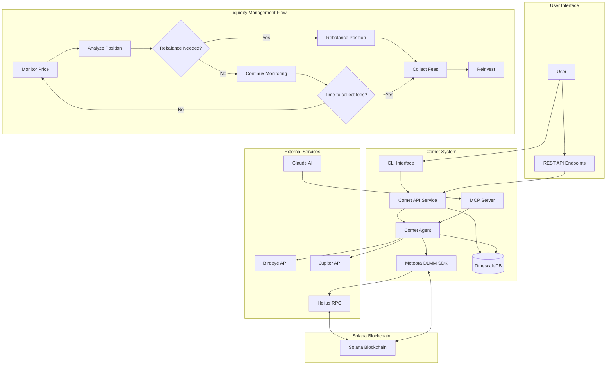

# Comet - Autonomous Liquidity Agent for Meteora DLMM

<p align="center">

</p>
<br>

Comet is an autonomous trading agent for Solana's Meteora protocol, designed to create a perpetual money machine by providing concentrated liquidity on Meteora's DLMM (Dynamic Liquidity Market Maker) pools.

## ⚠️ DISCLAIMER

**USE AT YOUR OWN RISK. POTENTIAL LOSS OF FUNDS.**

This software is provided "as is", without warranty of any kind, express or implied. By using Comet, you acknowledge and accept the risks associated with blockchain-based trading, automated market making, and decentralized finance in general.

- Comet is experimental software in active development
- Strategies implemented may not be profitable in all market conditions
- Smart contract bugs, exploits, or failures could result in loss of funds
- The authors are not liable for any financial losses resulting from use of this software
- Test with minimal funds before committing significant capital
- Never use funds you cannot afford to lose

By using Comet, you take full responsibility for all outcomes, including potential partial or complete loss of funds.

## Architecture

Comet is built with a microservices architecture that combines real-time liquidity management with advanced time-series analytics:



## Features

- **Automated Pool Management**: Create and manage DLMM pools with specified parameters
- **Intelligent Liquidity Provision**: Add liquidity concentrated around the current price for maximum fee earnings
- **Dynamic Rebalancing**: Monitor pool prices and automatically rebalance positions
- **Fee Collection**: Collect and reinvest trading fees to compound returns
- **Multiple Strategies**: Support for Spot, BidAsk, and Curve liquidity distribution strategies
- **AI-Enhanced Decision Making**: Integration with Claude AI for intelligent rebalancing recommendations
- **Market Analysis**: Advanced volatility and trend analysis for optimized positioning
- **REST API and CLI**: Manage your agents through an API or command line interface
- **Time-Series Analytics**: Track historical performance with PostgreSQL and TimescaleDB
- **Dockerized Deployment**: Run the entire system with a single docker-compose command
- **Fault Tolerance**: Robust error handling and automatic recovery mechanisms
- **Performance Monitoring**: Real-time monitoring of positions, fees, and rebalance events
- **Enhanced Market Data**: Integration with Birdeye Starter Plan for detailed market analytics

## Installation

### Local Development

```bash
# Install dependencies
bun install

# Build the project
bun run build
```

### Docker Setup

The application is fully containerized with Docker, including a PostgreSQL database with TimescaleDB extension for time-series data:

```bash
# Build and start all services
docker-compose up -d

# Build and start specific services
docker-compose up -d timescaledb comet-api

# View logs
docker-compose logs -f

# Stop all services
docker-compose down
```

The Docker setup includes:
- **TimescaleDB**: PostgreSQL with TimescaleDB extension for time-series data
- **Comet API**: REST API for managing agents and pools
- **Comet Agent**: Background service that manages liquidity positions
- **MCP Server**: Model Context Protocol server for Claude AI integration

## Configuration

Create a `.env` file based on `.env.example`:

```
# Comet Agent Configuration
RPC_URL=https://api.helius.xyz/v0/solanaqt
HELIUS_API_KEY=your_helius_api_key
BIRDEYE_API_KEY=your_birdeye_api_key
BIRDEYE_API_URL=https://public-api.birdeye.so
JUPITER_API_URL=https://price.jup.ag/v4

# Wallet Configuration
COMET_WALLET_KEY=your_wallet_private_key

# Strategy Configuration
COMET_POOL_ADDRESS=your_pool_address
COMET_STRATEGY=Spot  # Options: Spot, BidAsk, Curve
COMET_BIN_RANGE=10
COMET_AUTO_REBALANCE=true
COMET_MIN_REBALANCE_INTERVAL=3600000  # 1 hour in milliseconds
COMET_PRICE_DEVIATION_THRESHOLD=2.5   # % price change that triggers rebalance
COMET_FEE_COLLECTION_INTERVAL=86400000
COMET_POLLING_INTERVAL=60000
COMET_MAX_RETRIES=3
COMET_RETRY_DELAY=1000

# Claude AI Integration
CLAUDE_API_KEY=your_claude_api_key
CLAUDE_MODEL=claude-3-sonnet-20240229  # options: claude-3-haiku-20240307, claude-3-sonnet-20240229, claude-3-opus-20240229
CLAUDE_ENABLED=true
CLAUDE_RISK_PROFILE=moderate  # options: conservative, moderate, aggressive
CLAUDE_TEMPERATURE=0.1        # 0.0-1.0, lower = more deterministic
CLAUDE_MAX_TOKENS=1024        # max tokens in response

# MCP Server Configuration
MCP_PORT=3003
MCP_SERVER_URL=http://localhost:3003  # URL for Claude to access MCP server

# API Configuration
COMET_API_PORT=3001

# Logging
COMET_LOG_LEVEL=info  # debug, info, warn, error

# Rate Limiting Configuration
RATE_LIMIT_HELIUS_RPC=50
RATE_LIMIT_HELIUS_SEND_TX=5
RATE_LIMIT_HELIUS_PROGRAM_ACCTS=25
RATE_LIMIT_HELIUS_API=10
RATE_LIMIT_BIRDEYE_API=10
RATE_LIMIT_JUPITER_API=50
RATE_LIMIT_CLAUDE_API=1
RATE_LIMIT_CLAUDE_PERIOD=10000
RATE_LIMIT_MCP_API=10
```

## Usage

### Starting the Agent API Server

```bash
bun run start-agent
```

### Starting the MCP Server

```bash
bun run start-mcp-server
```

### Using the CLI

```bash
# Start an agent for a specific pool
bun run start-agent-cli start --pool <pool_address> --strategy Spot --auto-rebalance true --claude-enabled true --claude-risk moderate

# Create a new DLMM pool
bun run start-agent-cli create-pool --token-x <token_x_address> --token-y <token_y_address> --bin-step 20 --active-id 8388608 --fee-bps 20

# Add liquidity to a pool
bun run start-agent-cli add-liquidity --pool <pool_address> --amount-x 100000000 --amount-y 100000000 --strategy Spot --range 10

# Manually rebalance positions
bun run start-agent-cli rebalance --pool <pool_address>

# Collect fees
bun run start-agent-cli collect-fees --pool <pool_address>
```

### Running Birdeye Examples

```bash
# Run the Birdeye Starter Plan example
bun run birdeye-example
```

### API Endpoints

Start an agent:
```
POST /agents/start
{
  "poolAddress": "ARwi1S4DaiTG5DX7S4M4ZsrXqpMD1MrTmbu9ue2tpmEq",
  "strategy": "Spot",
  "binRange": 10,
  "autoRebalance": true,
  "claude": {
    "enabled": true,
    "riskProfile": "moderate"
  }
}
```

Stop an agent:
```
POST /agents/stop
{
  "poolAddress": "ARwi1S4DaiTG5DX7S4M4ZsrXqpMD1MrTmbu9ue2tpmEq"
}
```

Get agent status:
```
GET /agents/:poolAddress/status
```

Create a pool:
```
POST /pools/create
{
  "tokenX": "So11111111111111111111111111111111111111112",
  "tokenY": "EPjFWdd5AufqSSqeM2qN1xzybapC8G4wEGGkZwyTDt1v",
  "binStep": 20,
  "activeId": 8388608,
  "feeBps": 20,
  "activationType": 1,
  "hasAlphaVault": false
}
```

Add liquidity:
```
POST /pools/:poolAddress/add-liquidity
{
  "amountX": "100000000",
  "amountY": "100000000",
  "strategy": "Spot",
  "binRange": 10
}
```

Rebalance positions:
```
POST /pools/:poolAddress/rebalance
```

Collect fees:
```
POST /pools/:poolAddress/collect-fees
```

### MCP Server Endpoints

Get token information:
```
GET /api/token/:address
```

Get token OHLCV data:
```
GET /api/token/:address/ohlcv?timeframe=1H&limit=24
```

Get token trades:
```
GET /api/token/:address/trades?limit=20
```

Get token pair data:
```
GET /api/pair/:baseAddress/:quoteAddress?timeframe=1H&limit=24
```

Get wallet portfolio:
```
GET /api/wallet/:address/portfolio
```

Get wallet historical trades:
```
GET /api/wallet/:address/trades?limit=50
```

Get token top holders:
```
GET /api/token/:address/holders?limit=20
```

Get all context for Claude:
```
GET /api/claude-context
```

## System Components

### Comet API Service
The API service provides RESTful endpoints for managing agents, pools, and viewing performance metrics. It's built with Hono, a lightweight, high-performance web framework.

### Comet Agent
The autonomous agent monitors pool conditions, rebalances positions, and collects fees. It runs as a standalone service and can be controlled via API or CLI.

### MCP Server
The Model Context Protocol (MCP) server allows Claude AI to access additional context without consuming context tokens. It provides market data, portfolio information, and other relevant data.

### TimescaleDB
PostgreSQL with TimescaleDB extension provides high-performance time-series data storage for:
- Historical price data
- Pool metrics
- Rebalance events
- Fee collections
- Performance analytics

### Strategies

- **Spot**: Distributes liquidity evenly around the active bin
- **BidAsk**: Concentrates liquidity at the active bin and spreads out
- **Curve**: Distributes liquidity in a normal distribution around the active bin

### Claude AI Integration

The Comet agent integrates with Anthropic's Claude AI to enhance decision-making for liquidity management:

- **Intelligent Rebalancing**: Uses AI to analyze market conditions and determine optimal rebalancing timing
- **Strategy Selection**: Dynamically selects the best strategy based on current market conditions
- **Risk Profile Adaptation**: Adjusts bin range and distribution based on volatility analysis
- **Market Trend Analysis**: Identifies market trends and positions liquidity accordingly
- **Confidence-Based Decisions**: Provides confidence scores with recommendations for enhanced transparency

## Birdeye Starter Plan Integration

Comet integrates with Birdeye's Starter Plan API to access enhanced market data and analytics:

### Available Data Sources

- **Token Information**: Detailed metadata and trading attributes for any Solana token
- **Market Data**: Real-time market metrics including volume, liquidity, and trends
- **OHLCV Data**: High-quality candlestick data for tokens and pairs at various timeframes
- **Trade History**: Recent trades for specific tokens and trading pairs
- **Wallet Analytics**: Portfolio composition and historical trades for any wallet
- **Top Holders**: Ownership distribution for tokens

### MCP Integration

All Birdeye data is exposed through the MCP server, allowing Claude AI to access it when making rebalancing decisions. This provides Claude with richer context about market conditions without consuming context tokens.

### Usage Example

The `birdeye-example` script demonstrates how to use the Birdeye Starter Plan API:

```typescript
// Get token information
const tokenInfo = await getTokenInfo(SOL_MINT);

// Get OHLCV data (1 hour candles)
const ohlcvData = await getTokenOHLCV(SOL_MINT, '1H', 5);

// Get pair trades (SOL/USDC)
const pairTrades = await getPairTrades(SOL_MINT, USDC_MINT, 5);

// Get wallet portfolio
const portfolio = await getWalletPortfolio(WALLET_ADDRESS);
```

## Data Model

```mermaid
erDiagram
    AGENTS ||--o{ POOLS : manages
    AGENTS ||--o{ REBALANCE_EVENTS : triggers
    AGENTS ||--o{ FEE_COLLECTION_EVENTS : performs
    POOLS ||--o{ POSITIONS : contains
    POOLS ||--o{ POOL_METRICS : tracks

    AGENTS {
        int id
        string pool_address
        string wallet_address
        string status
        string strategy
        int bin_range
        boolean auto_rebalance
        timestamp created_at
        timestamp updated_at
    }

    POOLS {
        int id
        string address
        string token_x_address
        string token_y_address
        string token_x_symbol
        string token_y_symbol
        int bin_step
        int active_bin_id
        int fee_bps
        timestamp created_at
        timestamp updated_at
    }

    POSITIONS {
        int id
        string address
        string pool_address
        string wallet_address
        int min_bin_id
        int max_bin_id
        numeric liquidity_x
        numeric liquidity_y
        timestamp created_at
        timestamp updated_at
    }

    POOL_METRICS {
        timestamp time
        string pool_address
        int active_bin_id
        numeric current_price
        numeric token_x_price_usd
        numeric token_y_price_usd
        numeric liquidity_x
        numeric liquidity_y
        numeric total_value_locked_usd
        numeric volume_24h
        numeric fees_24h
    }

    REBALANCE_EVENTS {
        timestamp time
        int agent_id
        string pool_address
        int old_active_bin
        int new_active_bin
        numeric old_price
        numeric new_price
        string transaction_hash
        boolean success
        string error_message
    }

    FEE_COLLECTION_EVENTS {
        timestamp time
        int agent_id
        string pool_address
        string position_address
        numeric amount_x
        numeric amount_y
        numeric amount_x_usd
        numeric amount_y_usd
        string transaction_hash
        boolean success
        string error_message
    }
}
```

## Contributing

Contributions are welcome! Please feel free to submit a Pull Request.

## License

ISC

## Credits

Built with the [Meteora DLMM SDK](https://github.com/MeteoraAg/dlmm-sdk)